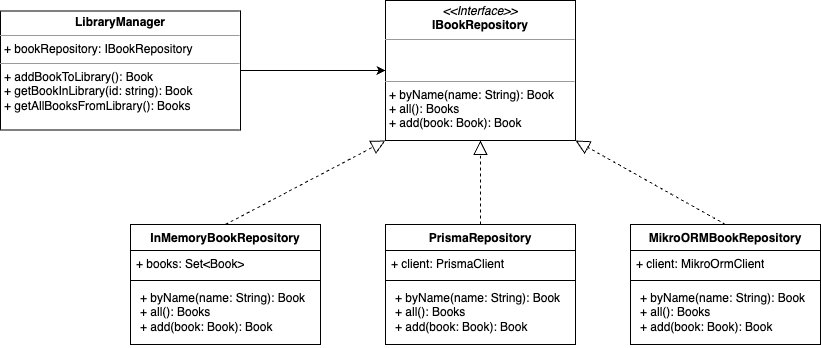

# Description

The purpose of this project is to demonstrate how you can abstract your datasource providers from your domain.

Let's imagine we have a library at home with books and we want to organize it because it's a mess and we don't know what's in.
We want a simple app that allows us to add book to library, get one by name or get all the library.
We are not sure of which datasource provider would be the best. 
Do we want to use an ORM or something in memory ? Beyond that which ORM ? All are different.

To achieve this we will abstract our repositories and make custom implementations for each of them

After a quick search we found out that we have 3 possible datasource providers for our books : In-Memory, Prisma, MikroOrm.

So that means at least 2 repository custom implementation (Because we want to have an In-Memory datasource for when we work with no Internet)

We will let our app know at startup which implementation our dependency injection should load.

# Definition of terms

Here we define all terms that may be used in the applicative domain

| Name     | Description    |
|----------|----------------|
| Book     | A book         |
| Books    | A list of book |

# Technical Data

Our application will have a main class, LibraryManager, who will manage all actions related to our books. LibraryManager will
have a book repository to let it get a book, add a book or get all books.

Our app is structured following hexagonal architecture principles.

Meaning we expose our application through primary ports and let her consume services through secondary ports.

We have here one secondary port : IBookRepository which can be connected to various datasource providers

We have only one primary port implemented : console-app.

# How to start project

You will need .env file with the following paramters :
- BOOK_REPOSITORY_DATASOURCE
- DATABASE_URL

BOOK_REPOSITORY_DATASOURCE takes 3 possibles parameters IN_MEMORY / PRISMA / MIKRO_ORM

If you use PRISMA or MIKRO_ORM think of generating the corresponding schema using one of these following npm commands :
- `npm run db:prisma-migration`
- `npm run db:mikro-orm-migration`

Run `npm run start` to start the project

# Links

MikroORM documentation : 
https://mikro-orm.io/docs/installation

Prisma documentation :
https://www.prisma.io/docs

# TODO
- Maybe add acceptance tests with cucumber